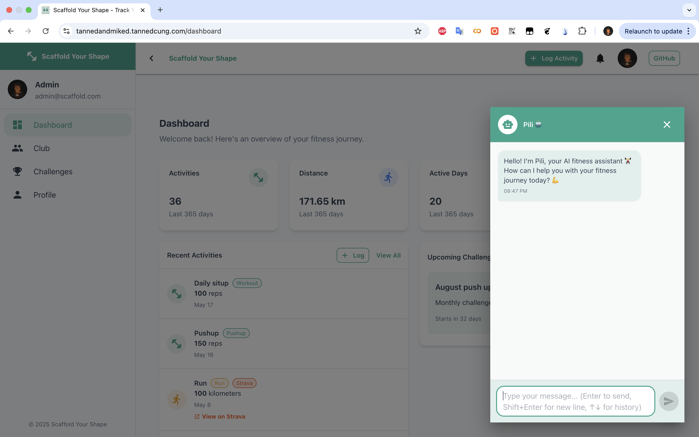

# Scaffold Your Shape - Fitness Tracking Application



A comprehensive fitness tracking application that allows users to track various exercises (push-ups, pull-ups, bench press, etc.) and outdoor activities (running, walking, swimming, etc.).

## Features

- **Dashboard**: Personalized dashboard showing your fitness statistics and progress
- **Club**: Join fitness communities to connect with like-minded people
- **Challenges**: Compete in fitness challenges with other users
- **Profile**: Track your fitness journey with detailed statistics
- **Sync with Strava**: Seamlessly integrate your Strava activities
- **Multi-agent Chatbot**: Interact with a smart chatbot for assistance

## Tech Stack

- **ReactJS**: Using Next.js 15+ for frontend framework
- **Material UI**: For modern, responsive UI components
- **Auth.js**: For secure user authentication
- **Supabase**: Database and backend services

## Getting Started

### Prerequisites

- Node.js 16.8+ installed
- npm or yarn package manager

### Installation

1. Clone the repository:

```bash
git clone https://github.com/TannedCung/Scaffold-your-shape.git
cd Scaffold-your-shape
```

### Supabase Schema Migration

To ensure your Supabase database matches the latest schema, run the following (requires the Supabase CLI):

```bash
# Install Supabase CLI if you haven't already
Follow the instructions here: https://supabase.com/docs/guides/cli to install the Supabase CLI

# Log in to Supabase CLI (you'll need your access token)
supabase login

# Link your project (replace <project-ref> with your Supabase project ref)
 <project-ref>
supabase link --project-ref
# Push the schema to your Supabase database
supabase db push
```

Alternatively, you can copy the contents of `supabase_schema.sql` and run them in the Supabase SQL editor in your dashboard.

2. Install dependencies:

```bash
npm install
# or
yarn install
```

3. Create a `.env.local` file in the root directory with the following variables:

```
NEXTAUTH_URL=http://localhost:3000
NEXTAUTH_SECRET=your_nextauth_secret

# Supabase credentials
NEXT_PUBLIC_SUPABASE_URL=your_supabase_url
NEXT_PUBLIC_SUPABASE_ANON_KEY=your_supabase_anon_key

# Google OAuth (optional)
GOOGLE_CLIENT_ID=your_google_client_id
GOOGLE_CLIENT_SECRET=your_google_client_secret
```

4. Start the development server:

```bash
npm run dev
# or
yarn dev
```

5. Open [http://localhost:3000](http://localhost:3000) with your browser to see the application.

## Folder Structure

```
scaffold-your-shape/
├── public/                 # Static files
├── src/
│   ├── app/                # Next.js App Router
│   │   ├── (auth)/         # Authentication routes
│   │   ├── (main)/         # Main application routes
│   │   └── layout.tsx      # Root layout
│   ├── components/         # Reusable UI components
│   ├── contexts/           # React contexts
│   ├── lib/                # Utility libraries
│   ├── types/              # TypeScript types
│   └── utils/              # Helper functions
├── .env.local              # Environment variables
└── ...
```

## License

This project is licensed under the MIT License.
